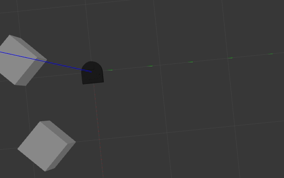
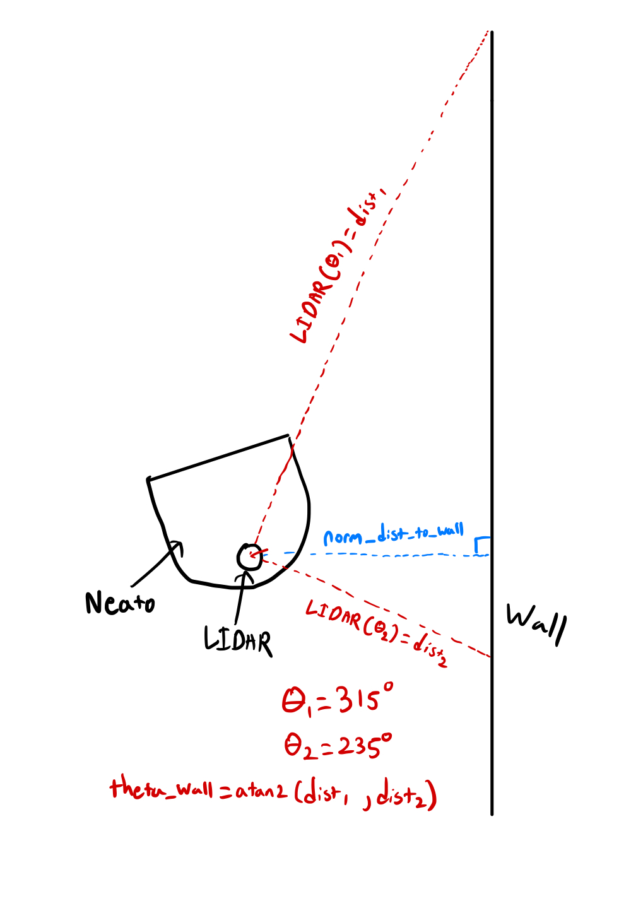
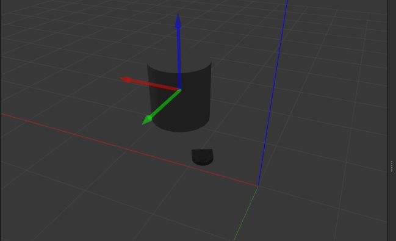
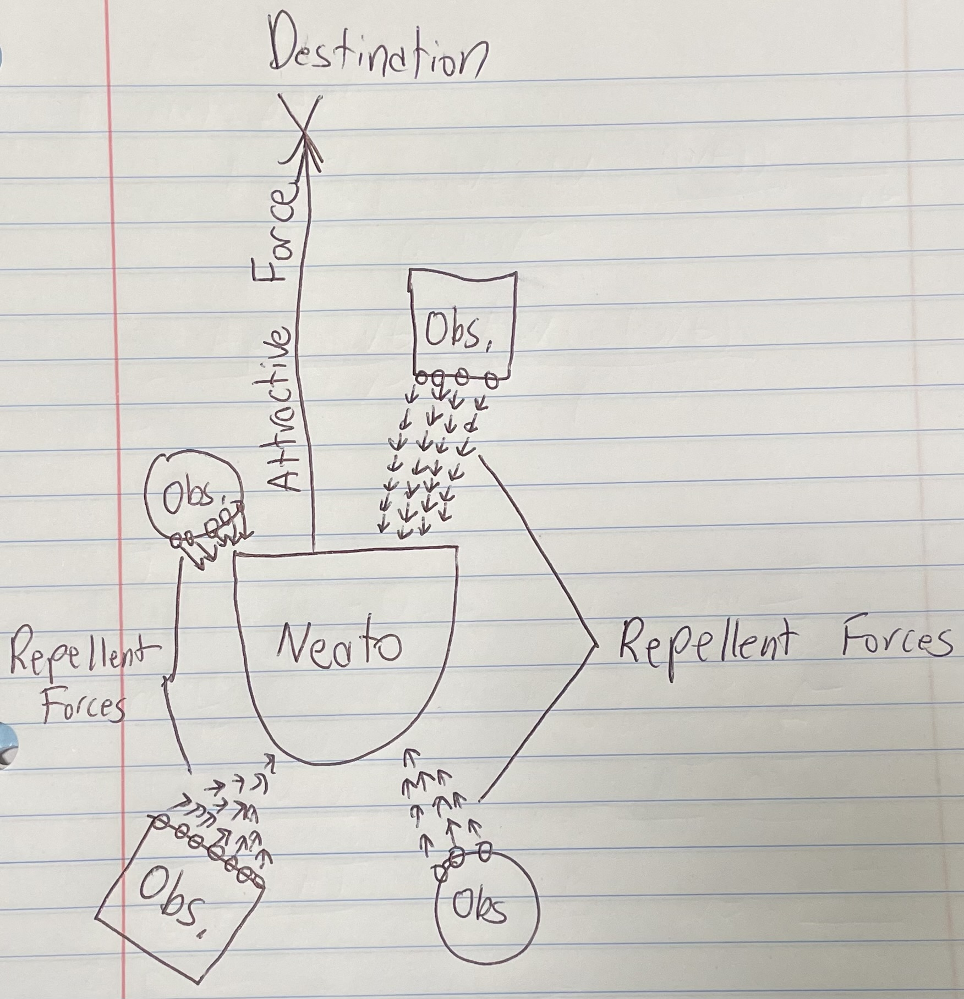
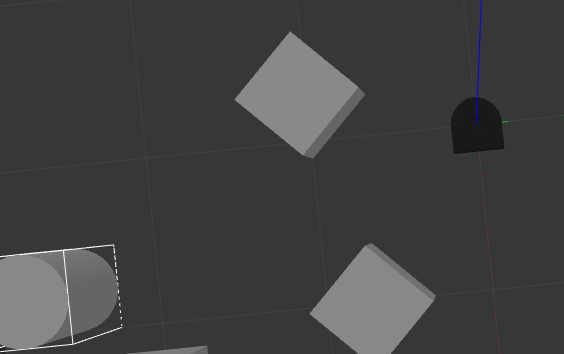
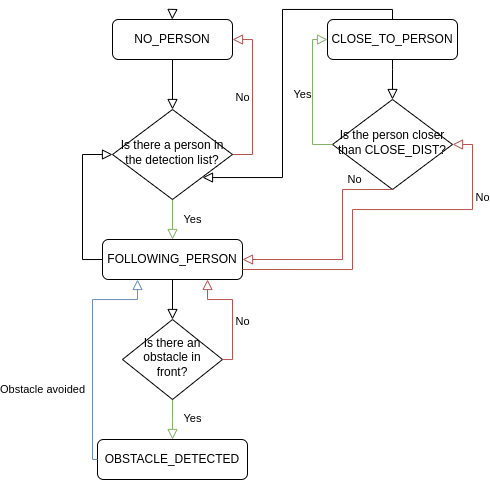

# Computational Robotics Warm-up Project
## Project Overiew
The purpose of this project was to develop an introductory understanding of ROS (Robot Operating System), understand how sensor data can be used to dynamically change robot behavior, and develop intuition on how to debug robotic systems using a [Neato](https://neatorobotics.com/). The Neato has a wide variety of features, including odometry tracking, 360 degree LiDAR, and bump sensors, which were implemented to develop numerous robot behaviors outlined in this document.

## Robot Behaviors
### Teleop
#### Behavior Description
Teleop (teloperation) allows for controlling the Neato from a remote location. In this implementation, the robot can be controlled through an externally connected laptop by interfacing with a Raspberry Pi attached to the Neato. 

The Teleop behavior maps 9 keyboard inputs (Q, W, E, A, S, D, Z, X, C) to 9 different drive commands. The specific mapping is shown below:
- Q: Veer Right (forward)
- W: Straight
- E: Veer left (forward)
- A: Turn Right
- S: Stop
- D: Turn Left
- Z: Veer Left (reverse)
- X: Reverse
- C: Veer Right (reverse)

In addition, pressing `Ctrl+C` stops the robot's motion and terminates execution of the Teleop node.
#### Features
The code structure for the Teleop Node consists of three primary functions: `__init__()`, `get_key()`, and `run_loop()`. 

The initializer is responsible for creating a publisher to publish Twist objects to the /cmd_vel topic, which dictates the linear and angular velocity of the Neato. It also creates a 10 Hz timer that calls run_loop() on every timer increment.

`get_key()` is what allows the node to interface with user input. The function listens to the user's keyboard and returns a string representation of the key that was pressed.

`run_loop()` is responsible for publishing Twists to the /cmd_vel topic. The function starts by calling get_key() to receive a user key press. If the key is one of the 9 defined robot movements, the publisher publishes a Twist command to the Neato that corresponds to the specified action. If `Ctrl+C` is pressed, a Twist command containing 0 linear and angular velocity (stop) is sent and execution of the loop is terminated.
#### Demo

#### Limitations
The current implementation of Teleop has three main limitations: keypresses cannot be combined, the driving structure is not intuitive, and reading keyboard input stalls other processes. Currently, when the user presses two keys at once, the specified motion corresponds to only the most recent press. However, intuitively, a user would expect the motion to be a combination of the two presses. For example, if 'A' and 'D' is pressed, the robot should stay in place as the two motions cancel out. Another unintuitive aspect of the current driving system is if one key is simply pressed and released, the robot continues in that motion until another key is pressed. This seems less logical than having the robot only move in a certain motion while the key is pressed, and stop that motion when it is released. Finally, the current implementation of `get_key()` is a limiting factor as it stalls all other processes. `get_key()` runs a loop that listens for keyboard input, and only finishes execution once a key has been pressed. This limits the teleop node's ability to run other processes concurrently with listening for user input.

### Square Drive
#### Behavior
The purpose of the drive square behavior is to command the Neato to drive in a 1m by 1m square. The biggest challenge that needed to be solved was determining when the Neato needed to turn and when it needed to drive straight in order to follow the path of a square. In this implementation, the challenge was solved by tracking the odometry of the Neato. 

The Neatos have odometry sensors that can be subscribed to, which return the position (received as a Point object) and orientation (received as a Quaternion object) of the Neato. Using this information, we have an accurate sense of where the Neato is and where it is facing, which is all the information we need to navigate the Neato. Upon start up, the position and orientation is stored and the Neato is instructed to drive straight. Once the current position of the Neato differs with the stored position by 1m, the state of the Neato changes to rotating. Now, the current orientation is compared with the stored orientation until they differ by 90 degrees (rotating in the counterclockwise direction). After that threshold is reached, the state of the Neato is changed to driving straight, and the cycle continues. After each state change, the orientation/position is updated to be used in the next comparison.
#### Demo

#### Limitations
The biggest limitation of the current drive square implementation are inaccuracies associated with rotating exactly 90 degrees at each corner of the square. The Neato has a tendency to over-rotate during some rotations. This error can be attributed to two causes: odometry tracking error and timing delays. There are inherent inaccuracies with the odometry data coming from the Neato, which can become magnified over the course of the Neato's trajectory, causing errors in the Neato's rotation. Additionally, the Neato is sent commands at discrete intervals, rather than being continuous. This means that the Neato can not instantaneously stop the moment it has rotated 90 degrees, but rather, is only sent the stop rotating command after it has detected a 90 degree rotation. Since the Neato has inertia, it continues to rotate slightly after 90 degrees in the time it takes to send the stop rotating command, causing an over-rotation.

Another limitation of the current implementation of driving in a square is the lack of obstacle avoidance during traversal. Currently, the drive_square implementation takes minimal feedback from the environment, meaning if there is an obstacle that obstructs the square, the Neato will simply run into the object rather than trying to avoid it. This will hinder it from completing its full trajectory, preventing it from accomplishing the given challenge.
### Wall Follower
#### Behavior
For this behavior, we were tasked with making a controller that makes the Neato follow a wall at a specific distance without colliding into it. The primary sensor we used was the spinning LIDAR attached on top of the Neato which provides distance measurements at all angles around the robot. To start, we identified two main factors that are important to control to ensure the Neato does not collide as it drives parallel to the wall: angle relative to the wall and normal distance to the wall. While we realize that only controlling the distance to the wall would also result in a wall following behavior, we wanted to penalize the controller from taking drastic angle changes and gradually respond to error. To find the distance normal to the wall from the Neato, we realized that the minimum of the lidar measurements would give the approximate distance since the smallest distance measurement will be closest to orthogonal. Next, for the angle measurement, we used the 45+ and 45- degree measurements from the right side of the Lidar as shown in the diagram below:



To calculate the angle relative to the wall by taking the inverse tangent of the right triangle formed by the LIDAR measurements and the wall. With both these values, we now had to control these values and minimize the angle `theta_wall` as well as `TARGET_DIST-normal_dist_to_wall`. To do so, we used a proportional controller with one coefficient for each parameter and tuned the values to allow for a rotational correction to be applied as the Neato is driving forward. 

#### Limitations

```
TODO add stuff about detecting a wall in front of us.
TODO add stuff about not detecting walls
TODO improvements after testing on real robot
TODO code samples
```

### Person Follower
#### Behavior
To implement a person following behavior, we started by making the assumption that the only object in our environment is the person. This allows us to use the lidar data directly as an input to show where the Neato should head. First, we can convert all of the measured lidar data from polar coordinates to be in the lidar’s reference frame. Next, we can find the centroid of all the measured data by averaging the coordinates. This point becomes the target location we want the Neato to go to. To find the action the Neato should take, we can find the distance and angle to the point in our lidar frame both of which we are looking to control. 

In order for the Neato to orient the heading towards the person and control the target distance to the person to be 0.5m, we can use two proportional controllers for the linear and angular velocity of the robot. However, when the Neato is oriented away from the person, we need to still ensure that the Neato goes towards the person. To do so, we can invert the target distance and angle to make the Neato back towards and curve away from the person and then switch back to the forward oriented control.


#### Limitations
One of the primary limitations of this implementation is the inability to segment a person from an environment where non-person objects exist.

### Obstacle Avoidance 
#### Behavior
The obstacle avoidance behavior is intended to guide a Neato towards a specific destination (represented as a (x,y) cooridinate) while also avoiding any obstacles along the way. The primary challenge in implementing this behavior is being able to balance motion towards the destination and motion away from any detected obstacles. 

For this implementation, a potential field was made to define the optimal path of travel for the Neato. An example of the force field is shown below:



Each object titled "Obs." represents an obstacle in the way of the Neato. They exert a repellent force on the Neato, deterring its motion away from the obstacle. These forces are obtained through the LiDAR scan, where each circle on the obstacle represents a point detected by the LiDAR. Then, the force vector is formed in the direction from the obstacle point to the Neato and the magnitude of the vector is equal to the `FORCE_PARAMETER` (a tunable constant) divided by the squared distance that the obstacle is away from the Neato.

In addition to the repellent force, there is an attractive force that pulls the Neato towards its detination. This force is defined as the vector from the destination to the current position of the Neato (which is found by extracting Odometry data from the Neato). The magnitude of this vector is equal to the `ATTRACTIVE_PARAMETER` (a tunable constant) divided by the distance the Neato is away from the destination. Originally, the magnitude was only scaled by the `ATTRACTIVE_PARAMETER`, but during experiments, it was found that the Neato would "dance" around its destination, rather than successfully reaching it, especially in the presence of obstacles. For this reason, it was decided to increase the attractive force as the Neato approached its destination.
#### Demo

#### Limitations
The current implementation of obstacle avoidance has two main limitations: limited destinations and overfitting. Currently, if a destination is too close to an obstacle, the Neato will not be able reach that point because the repellent force overwhelms the attractive force. This potentially could be solved by tuning the `ATTRACTIVE_PARAMETER`, however, this might overwhelm the repellent force of other obstacles, causing the Neato to collide this those objects.

Another limitation tothe current implementation is overfitting. The tuned parameters work in only certain specific conditions and if the target is moved, the parameters need to be re-tuned for the new case. In addition, the idea of increase the attractive force as the Neato approaches the destination works in most cases in testing (in the neato gauntlet world), but this may not be correct in different environments (ex: very tight window to the destination, requiring precise movements). In future implementations, the behavior will be made to be more generalizable, requiring less tuning for different situations.

### Finite State Machine

#### Behavior
For the finite state machine project, we wanted to combine the person follower and obstacle avoidance behaviors. The motivation for this combination was from the limitations we faced when testing the person following behavior on the physical Neato. We found that lidar filtering was required for proper segmentation which forces the controller to remove information about the environment which could have been used to better follow the person. To overcome this challenge, we started by moving the person following logic to a separate and more suitable sensor: a camera and more effectively used the Lidar for obstacle avoidance. With a camera, we were able to do more precise object segmentation by using prebuilt object detectors such as YOLO.


To implement the combined behaviors, we used a finite state machine with four separate states:
- NO_PERSON: Spin Neato in direction of last seen person (default to CCW)
- CLOSE_TO_PERSON: Stop Neato 
- OBSTACLE_DETECTED: Set goal to 2m in front and apply force based obstacle avoidance
- FOLLOWING_PERSON: Proportionally orient to face person and drive at constant speed forward



Finally, we arrive at the desired behavior below:


#### Limitations
Our primary limitation with this method is the constrained obstacle avoidance due to the Neato fully switching to avoiding the obstacle when anything is detected in front and only leaving the state when the temporary goal is reached.

## Code Structure
For our project, we chose to to separate our code into separate nodes for each separate behavior. This was done so that each behavior can be simply called by running its corresponding node. Each node was structured as a class that extends the Node class. Within each of these classes (with the exception of wall_follower), there is an initializer, helper functions, and a main loop. The intializer is used to instantiate the Node, declare any subscriptions and publishers, and initialize any variables. It also instantiates a timer, which calls the main loop at a frequency of 10 hz. The main loop is used to send Twist (velocity) commands to the Neato and handle any state transitions that are needed. The helper functions are used to handle intermediate transitions and update instance variables that track the status of sensor data from the subcriptions. 

One exception is wall_follower, where the main loop functionality is handled by the helper function that handles data from the LaserScan subscription. Additionally, the finite state machine, which includes all the elements mentioned above, also has a helper class. This helper class is designed to handle the state where the Neato is avoiding a detected objected. This design decision was made in order to abstract the obstacle avoidance away from the main implementation of the finite state machine.

## Reflection
If we had more time, we would want to iterate on some of our current behaviors to improve their functionality and performance. This would include fixing errors associated with odometry (especially with square driving), since odometry errors tended to accumulate over time, impacting our understanding of the Neato's position. In addition, we would like to improve some of our path planning algorithms throughout our behaviors, which could be accomplished by implementing an algorithm like Rapidly-exploring Random Tree, or simply establishing waypoints for desired positions rather than using velocities to command the Neato. 

In addition, we have several key takeaways that we gained from this experience, which are:
1. We can't be 100% reliant on the sensors on the Neato. Especially in terms of odometry, there are natural variances and errors with making measurements, meaning that this data can not be taken as fact and needs adjustments to accomplish a given task.
2. The real world is a significantly different development environment than the simulated world. For several of the behaviors, we had perfect implementations that consistently worked in Gazebo, but were surprised to see that it failed when testing on the physical Neato. This definitely taught us that the unpredictability of the real-world is a factor we need to consider when designing a system for a robot.
3. The ROS debugging tools are very helpful. Rather than simply print-based debugging (which is only mildly effective in typical software development), ROS gives several tools for visualization, like RQt that allow us to assert whether our code is acting as expected and more directly pinpointing any fail cases.

As a whole, we both found this project to be an excellent learning experience and allowed us to take innovative angles on new problems, ultimately allowing us to develop advanced behaviors.
